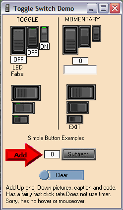

## Rocker Switch usercontrol

### Description

Been practiceing my graphics skills and made this rocker switch control. Also included a simple button control that I use to test my graphics with. Thought someone might like to use it too. It has a fairly fast click rate. Hope you find these controls useful.
 
### More Info
 

             |
---                |---
**Submitted On**   |2010-03-26 16:15:04
**By**             |[Kenneth Foster](https://github.com/Planet-Source-Code/PSCIndex/blob/master/ByAuthor/kenneth-foster.md)
**Level**          |Intermediate
**User Rating**    |5.0 (20 globes from 4 users)
**Compatibility**  |VB 6\.0
**Category**       |[Custom Controls/ Forms/  Menus](https://github.com/Planet-Source-Code/PSCIndex/blob/master/ByCategory/custom-controls-forms-menus__1-4.md)
**World**          |[Visual Basic](https://github.com/Planet-Source-Code/PSCIndex/blob/master/ByWorld/visual-basic.md)
**Archive File**   |[Rocker\_Swi217825412010\.zip](https://github.com/Planet-Source-Code/kenneth-foster-rocker-switch-usercontrol__1-73048/archive/master.zip)

